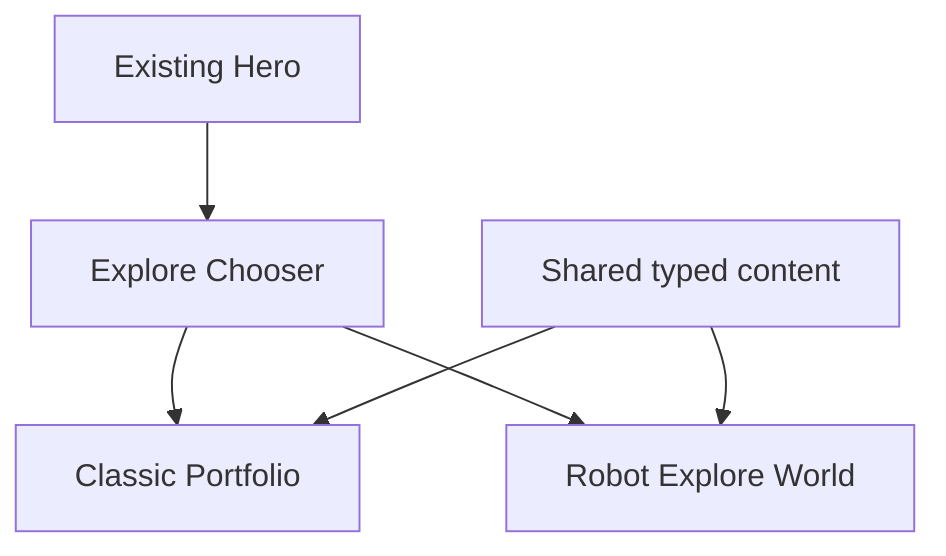

# Portfolio Documentation

Yeh folder portfolio revamp ka source of truth hai. Goal simple hai: site memorable ho, lekin information access kabhi harder na ho.

## Start Here

- [Revamp overview](revamp/00-overview.md)
- [Grounded repository audit](revamp/01-grounded-audit.md)
- [Architecture](revamp/02-architecture.md)
- [Delivery phases](revamp/03-delivery-phases.md)
- [Definition of done](revamp/13-verification.md)
- [Testing strategy](testing/README.md)

## Reference

- [Analytics API](api/analytics.md)
- [Design tokens](ui/design-tokens.md)
- [Component inventory](ui/components.md)
- [Documentation checks](LINT.md)
- [Legacy documentation notes](archive/README.md)

## Language

Overview aur roadmap Hinglish mein hain. Technical contracts, APIs, ADRs, aur tests English mein hain so implementation details precise aur durable rahen.
