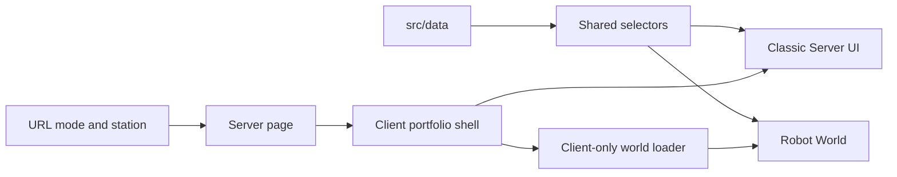

# Architecture

## Principles

1. One content model feeds both presentations.
2. Classic content is semantic HTML and remains available without WebGL.
3. Robot mode uses one active world canvas; stations and detail content remain DOM.
4. Movement, routing, selectors, and proximity are pure functions wherever possible.
5. Experimental Spline behavior cannot block the Classic release.

## Runtime Boundaries

[`src/app/page.tsx`](../../src/app/page.tsx) becomes a Server Component. It awaits Next.js 15 `searchParams`, calls the pure query parser, and passes initial values to a small client shell.

Classic sections should remain Server Components unless they need local interaction. Robot mode is loaded from a Client Component using `next/dynamic`; `ssr: false` is not declared in the Server page.

## World Boundary

The V1 world is a fixed-camera exhibition. Spline owns robot and environment rendering. React owns:

- controls and movement state
- station configuration and proximity
- HUD and interaction prompts
- accessible project/experience panels
- URL and analytics transitions

No station creates a canvas. Robot mode should maintain one active WebGL canvas. If measured cost requires it, entering Robot mode unmounts only the hero Spline layer while keeping hero text and photography.

## Failure Boundary

Missing robot root, scene load failure, unsupported WebGL, reduced motion, or small-screen default all resolve to Classic with a clear optional retry. See [Risks and fallbacks](15-risks-fallbacks.md).
